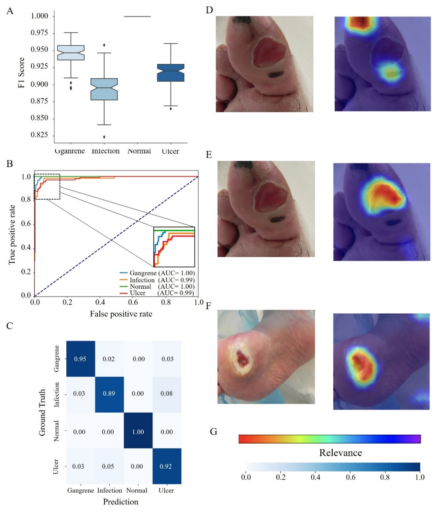

# Smart Diabetic Foot Ulcer Scoring System

[](LICENSE)
[](https://github.com/用户名/仓库名/stargazers)
[](https://github.com/用户名/仓库名/network)

本项目开发了一个用于糖尿病足溃疡（DFU）风险分层的评分系统。

## 目录

- [介绍](#介绍)
- [数据](#数据)
- [环境配置](#环境配置)
- [模型训练](#模型训练)
- [使用方法](#使用方法)
- [结果](#结果)


## 介绍

本项目基于深度学习开发了一个为糖尿病足溃疡智能评分的系统

## 数据
该数据集包含来自DFUC 2020、湘雅医院内分泌科和Kaggle的糖尿病足溃疡图片，并分为训练集、验证集和测试集。

## 环境配置
Python 3.7.16 + PyTorch
其他必要的依赖项可以在 `requirements.txt`中找到

```sh
conda create -n DFU
conda activate DFU
```
```sh
pip install -r requirements.txt
```

## 模型训练

### 分割模型(Det4DFU)

在模型训练阶段，我们采用了 U-Net 结构进行多类别分割任务，以分析糖尿病足溃疡，精准捕捉不同特征并提高分割准确性。
```sh
cd Det4DFU
```
根据 `media`文件夹结构进行相应数据组织
`kfold.py`设置k折交叉验证数据集
加载数据集 ，`dfu_load.py`是多类别的病变区域，可根据自己数据集修改对应编码和分类数
单类别分割用`dfu_single_load.py`

```sh
python kfold.py
python dfu_load.py
```
数据集加载完毕用unet进行分割。给到`dfu_train.py`和`multi_train.py`，
对于病变区域，单一使用多类别分割效果并不好，可以考虑使用级联的方式进行分割
`handle.py`实现分割病变区域前景部分，从而提高多类别分割精度
注意修改数据集。

在验证集和单独图片测试如下
```sh
python valid.py
```

### 分类模型(Clf4DFU)
我们选择了 ResNet50 作为基础网络，用于分类糖尿病足溃疡的病变特征。
```sh
cd Clf4DFU
```
根据 `split`文件夹结构进行数据组织，或通过`split.py`自动划分
```sh
python split.py
```
模型训练
```sh
python train.py
```

### 评分
更改`DFU_score.py`的图片路径和mask路径，实现评分

## 安装
前提条件
Python 3.x
TensorFlow
PyTorch
其他必要的依赖项可以在 requirements.txt 中找到

## 结果


